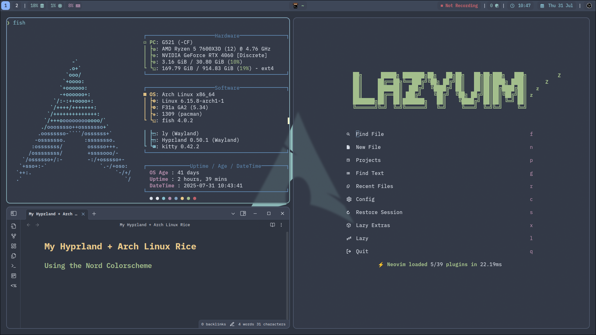
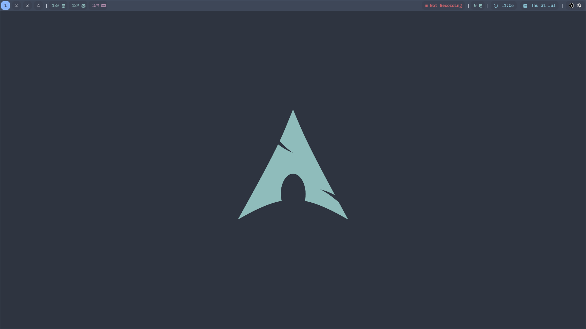
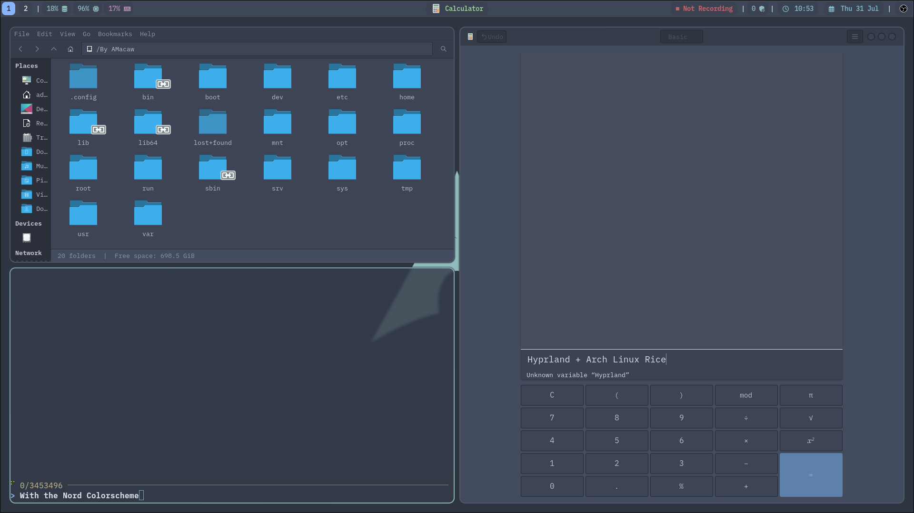

## This is a repo with my dotfiles for Arch, Hyprland, and other various applications.

### Installation Instructions

Most folders should be put in ~/.config but some like `assets` should be ignored and some like `Documents/Images/Wallpapers/` should be put in the home directory. 

For the waybar custom screenrecording module I have you need obs studio with websockets enabled without authentcation or manually change the password in the scripts from changeme to your password. 

The Obsidian theme I use is called `Obsidian Nord`

If you find any errors or have improvements please tell me and make a pull request!

Some images:

